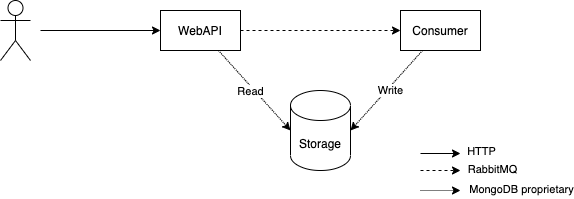

# Summary
This is a cluster of services that communicate via MassTransit (using RabbitMQ) and use MongoDB for data storage. The services are intended as proofs of concept that show the basic use of these technologies and can serve as a starting point for your own experiments.
The structure of the cluster is as follows:

|Service|Info|
|--|--|
|WebApi|Serves the public API using an ASP.NET Core web-controller.|
|Consumer|A console-application that listens for _'store message'_ commands sent via MassTransit. Processes such commands by storing their content in a database.|
|Storage|A MongoDB that contains the messages that should be stored.|

# Usage
## System Requirements
.NET6 SDK, Docker Desktop

## Post/Get Messages
1. Start the cluster with `docker-compose` (or use Visual Studio).
2. Send a message by POSTing it to the WebAPI. 
`curl --request POST --url http://localhost:8080/Messages --header 'Content-Type: application/json' --data '{"sender": "Alice", "recipient": "Bob", "content": "Hello World"}'`
3. Retrieve the message via GET request. The URL is transmitted in the location header of the POST response. 
_(Note: Posting a message is an asynchronous operation. It may take time for the system to transport and store the message.)_
4. To retrieve all messages stored in the system, send a GET to the [http://localhost:8080/Messages](/Messages) endpoint.

## Administration
* The admin-panel of RabbitMQ is available at [http://localhost:15672](http://localhost:15672). Use guest/guest to log in.
* The admin-panel of MongoDB is available at [http://localhost:8081](http://localhost:8081). Use admin/secret to log in.

# License
Copyright (c) 2022 by TillW. Licensed to you under the [MIT license](https://opensource.org/licenses/MIT).